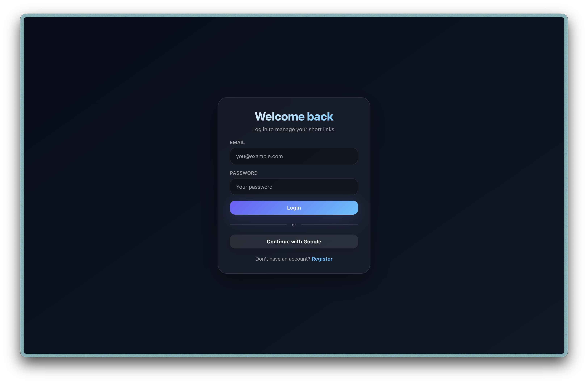
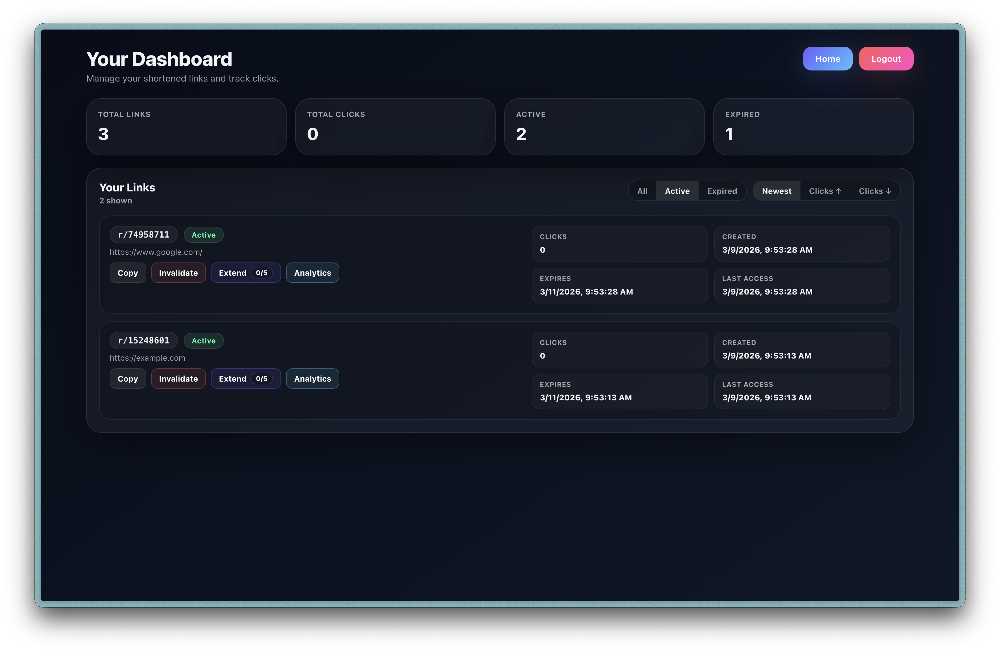
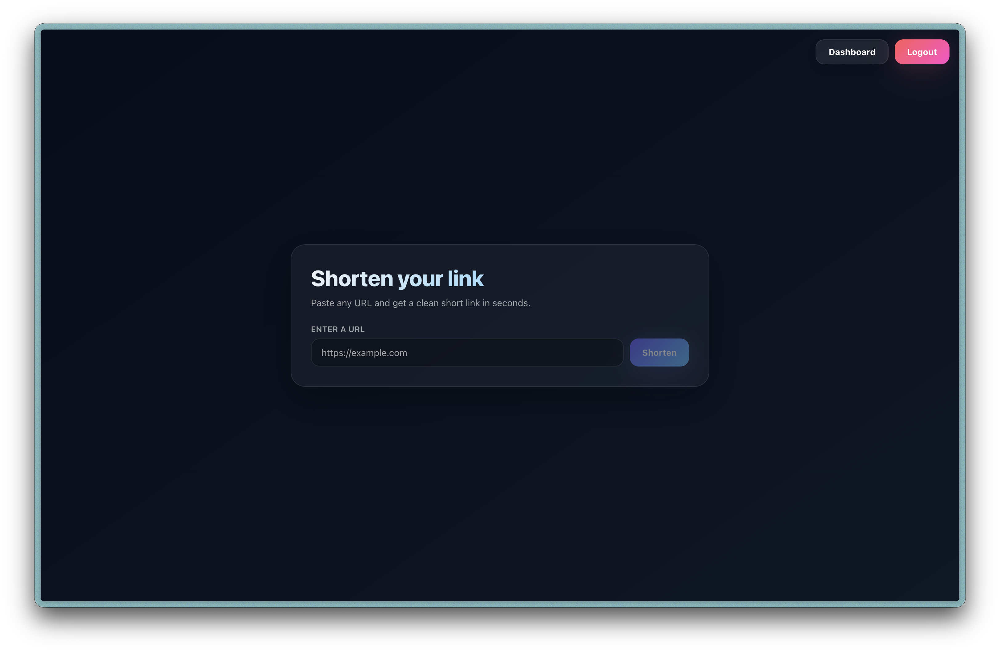

# MinURL — Backend API

**Java • Spring Boot • MySQL • AWS • Cloudflare • JWT**

Backend service for MinURL, a production-style URL shortening platform.

This repository contains the Spring Boot API responsible for authentication, link generation, redirect resolution, and database persistence.

The project focuses primarily on backend engineering, including secure authentication, REST API design, database modeling, and cloud deployment.

**Live Application**
https://minurl.xyz

**Backend API**
https://api.minurl.xyz

**Frontend Repository**
https://github.com/eduardMocanu/urlShortenerFrontend

---

## Project Overview

MinURL is a full-stack URL shortening platform where authenticated users can generate and manage shortened links.

The backend exposes a secure REST API used by the frontend client and handles:
- user authentication and authorization
- URL generation and redirect resolution
- user account management
- persistent storage of links
- protection against automated abuse

The system is deployed in the cloud and protected behind a CDN and origin shielding infrastructure.

---

## System Architecture

```
        ┌───────────────┐
        │     User      │
        └───────┬───────┘
                │
        ┌───────▼────────┐
        │ Cloudflare CDN │
        │ Rate limiting  │
        │ Edge security  │
        └───────┬────────┘
                │
        ┌───────▼──────────┐
        │ Cloudflare Tunnel│
        │  Origin shielding│
        └───────┬──────────┘
                │
        ┌───────▼────────┐
        │     AWS EC2    │
        └───────┬────────┘
                │
        ┌───────▼────────┐
        │     Nginx      │
        │ Reverse proxy  │
        └───────┬────────┘
                │
        ┌───────▼────────┐
        │  Spring Boot   │
        │   Backend API  │
        └───────┬────────┘
                │
        ┌───────▼────────┐
        │     MySQL      │
        │    Database    │
        └────────────────┘
```

Traffic first passes through Cloudflare's edge network where rate limiting and request filtering are applied.
Requests are then forwarded through a secure Cloudflare Tunnel to the private EC2 instance.
Inside the instance, Nginx acts as a reverse proxy, routing traffic to the Spring Boot backend service which communicates with the MySQL database.

---

## Core Backend Features

### URL Shortening Service

Authenticated users can create shortened URLs mapped to original destinations stored in a relational database.

### Redirect Resolution

Short URLs resolve through a redirect endpoint optimized for fast database lookups.

Example format:

```
https://api.minurl.xyz/r/{shortCode}
```

### JWT Authentication

Users authenticate using email and password credentials. After successful authentication, the backend issues a JWT stored in a secure HttpOnly cookie. The cookie is automatically included by the browser in subsequent requests to protected endpoints.

### Secure Endpoint Authorization

Spring Security protects backend endpoints using stateless JWT authentication with tokens delivered through secure HttpOnly cookies.

### User-Owned Links

Every shortened URL is associated with the user who created it.

### Abuse Prevention

The application requires authentication for URL creation and leverages CDN-level filtering and rate limiting to mitigate automated abuse.

---

## Tech Stack

**Backend**
- Java
- Spring Boot
- Spring Security
- Spring Data JPA
- Hibernate ORM
- JWT authentication
- HttpOnly secure cookies
- RESTful API design

**Database**
- MySQL
- relational schema for users and shortened links
- JPA entity mapping

**Infrastructure**
- AWS EC2 deployment
- Cloudflare CDN
- Cloudflare Tunnel (origin protection)
- edge-level rate limiting
- request filtering and bot mitigation

**Frontend (separate repository)**
- React
- Node.js
- cookie-based authentication
- communication with backend REST API

Frontend repository:
https://github.com/eduardMocanu/urlShortenerFrontend

---

## Project Structure

`src/main/java/com/example/urlShortenerServer`

**`config/`**
Application configuration and Spring Security setup.

**`controller/`**
REST API endpoints exposed to the frontend client.

**`service/`**
Business logic layer responsible for authentication, URL creation, and redirect resolution.

**`repository/`**
Database access layer implemented using Spring Data JPA.

**`domain/`**
Entity models representing users and shortened links.

**`filter/`**
HTTP request filters responsible for validating JWT tokens.

---

## Authentication Flow

1. User registers or logs in using email and password
2. Backend validates credentials
3. Server generates a JWT token
4. The JWT is stored in a secure HttpOnly cookie
5. The browser automatically includes the cookie with future requests
6. Spring Security validates the cookie to authorize protected endpoints

Requests without valid authentication cannot create shortened URLs.

---

## Example API Endpoint

Create a shortened URL.

```
POST https://api.minurl.xyz/shorten
```

Request body:

```json
{
  "urlAddress": "https://example.com"
}
```

Example response (201 Created):

```json
{
  "code": "123",
  "fullShortUrl": "https://api.minurl.xyz/r/123"
}
```

Authentication is handled automatically through the HttpOnly authentication cookie issued after login.

---

## Security Considerations

Several layers of protection are implemented to secure the application:

- authentication required for URL creation
- JWT-based authentication using HttpOnly secure cookies
- protection against client-side token access
- backend input validation and sanitization
- Cloudflare edge rate limiting
- CDN-level request filtering
- origin shielding using Cloudflare Tunnel

These measures help mitigate automated abuse and protect backend resources.

---

## Deployment

The backend API is deployed on AWS EC2 and served through Cloudflare.

Deployment stack:

```
Cloudflare CDN
↓
Cloudflare Tunnel
↓
AWS EC2 (private origin)
↓
Nginx reverse proxy
↓
Spring Boot API (api.minurl.xyz)
↓
MySQL database
```

This setup provides:

- CDN edge protection
- private origin infrastructure
- rate limiting and traffic filtering
- improved performance and security

---

## Running the Project Locally (Optional)

Requirements:

- Java 21+
- MySQL
- Maven or Gradle

Clone the repository:

```bash
git clone https://github.com/eduardMocanu/urlShortener
```

Configure database credentials in:

```
application.properties
```

Run the application:

```bash
./mvnw spring-boot:run
```

The backend will start at:

```
http://localhost:8080
```

---

## Application Preview

You can try the live application here: https://minurl.xyz

### Login



### Dashboard



### Create Short URL



---

## Learning Objectives

This project was built to explore:

- designing REST APIs with Spring Boot
- implementing secure authentication using JWT
- using HttpOnly cookies for secure token storage
- database modeling with JPA and Hibernate
- deploying backend services on AWS
- protecting public APIs using CDN-level infrastructure
- building full-stack systems with separate frontend and backend services

---

## Author

Backend-focused portfolio project exploring secure API design, authentication systems, and cloud deployment.

Feedback and suggestions are welcome.
